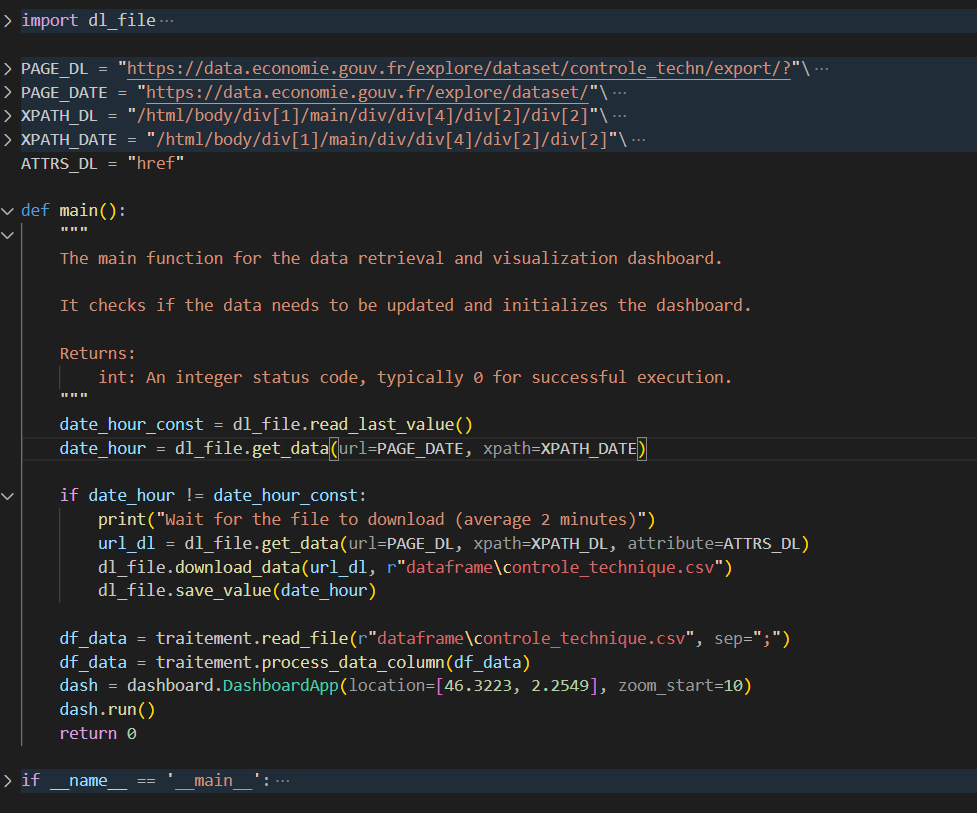

## THIS README IS IN FRENCH, PLEASE USE TRANSLATER IF NEEDED

# Tables des matières

## Guide de l’utilisateur
1. [De Git au répertoire local](#1---de-git-au-répertoire-local)
2. [Lancer le programme python ](#2---lancer-le-programme-python)
3. [Lancer le programme R et accéder au dashboard](#3---lancer-le-programme-R-et-accéder-au-dashboard)
4. [Utiliser le Dashboard](#4---utiliser-le-dashboard)

## Rapport d’analyse
1. [Rappels](#1---rappels)
2. [Analyse des données de controle technique en France](#---analyse-des-données-de-controle-technique-en-france)

## Guide du développeur
1. [Contexte](#1---contexte)
2. [Structure logique](#2---structure-logique)
3. [Continuer le développement](#3---continuer-le-développement)

# GUIDE DE L’UTILISATEUR

## 1 - De Git au répertoire local

Dans cette partie, nous allons nous intéresser sur comment récupérer le projet 
disponible sur Git dans le but de l’avoir sur la machine locale.

### Prérequis

- Ce projet est codé en python et R, c'est pourquoi il est nécessaire d’installer 
ces langages de programmation (ou les mettre à jour si nécessaire).

[Installer une version de python au moins égale à 3.11](https://www.python.org/downloads/)
[Installer une version de R au moins égale à 4.3.2](https://cran.r-project.org/bin/windows/base/)
[Installer la dernière version de RStudio](https://posit.co/download/rstudio-desktop/)

 - De plus il est nécessaire de télécharger git pour réaliser la récupération du projet

[Télécharger Git](https://git-scm.com/download/win)

### Exportation du projet et téléchargement des modules nécessaires

Une fois que vous disposez de ces prérequis, nous allons pouvoir exporter le 
projet sur votre répertoire local :

Cela se déroule en deux étapes :

1. Cloner le répertoire sur sa machine :

   Pour ce faire, ouvrez le ‘Git Bash’ (vous pouvez le chercher depuis la barre
   de recherche windows). Rentrez la commande suivante dans ‘Git Bash’ :

   *git clone https://git.esiee.fr/contedet/controle_technique_titouan_conte_devolx_r
     

2. Installer les packages nécessaires au programme python:

   Pour ce faire, ouvrez l' ’Invite de Commandes’ (vous pouvez la chercher 
   depuis la barre de recherche windows). À l’aide de la commande ‘cd’ rejoignez
   votre dossier ‘controle_technique_titouan_conte_devolx_r’ qui correspond au dossier
   cloné de Git.  

   Si vous rentrez la commande ‘dir’(windows, ‘ls’ pour unix) une fois dans 
   le dossier, vous devriez voir ceci :  

   

   ⚠Si ce n’est pas le cas, assurez-vous de bien vous 
rendre dans ce dossier avant de continuer⚠   

   Enfin, depuis ce dossier, rentrez la commande suivante :  

   *python -m pip install -r requirementspy.txt*

## 2 - Lancer le programme python

Veuillez bien attendre la fin de tous les téléchargements dans votre 
‘Invite de Commandes’.
Toujours dans ce terminal, entrez la commande suivante, cela permettra de lancer
le code en charge du bon fonctionnement de l’application : 

*python main.py*

Après quelques instants (soyez patient), vous devriez avoir ceci dans votre 
terminal : 

il est possible que la dataframe pré-telechargée dans le repertoire du projet
ne soit pas à jour. il faut donc attendre que le telechargement des données 
mises à jour se fasse (cela prend à peu près 2 minutes)

## 3 - Lancer le programme R et accéder au dashboard
    
    Désormais, il est nécessaire d'ouvrir le dossier du projet au sein 
    de RStudio. Une manière simple est de lancer l'invite de commande, de se 
    rendre dans le répertoire courant du projet puis de taper la commande 
    suivante :

    > start Conte-Devolx_Titouan.Rproj

    Attention à bien vous trouver à la racine du projet :  

    Voici à quoi doit ressembler l'interface de RStudio une fois le projet 
    ouvert :  

      

    Désormais, il est possible d'installer les différents packages présents 
    au sein du fichier "*requirements.txt*". Ce dernier peut s'ouvrir en
    double cliquant sur le fichier présent en bas à droite :  

      

    Au sein de la console présente sur la deuxième image, rentrer les 
    commandes suivantes pour chaque package :

    > install.packages("package_name")

    Il faut par ailleurs ajouter les packages python pour cela :

    > python -m pip install -r requirements_py.txt

## 4 - Utiliser le Dashboard

Lorsque vous ouvrez cet url, vous devriez obtenir ceci :

Voici quelques brèves annotations sur l’utilisation du site :

1. Ce Dropdown (menu de selection) permet de selectionner une région en France.
2. Ce Dropdown permet de selectionner un Département dans la région choisie.
il permet aussi de sélectionner les données de la région dans son ensemble (label : Région entière)
3. Ce Dropdown permet de selectionner un type de véhicule. 
4. Zone des différentes visualisations des données.
5. carte choropleth permettant de visualiser les prix moyens de chaque départements francais.
6. zone donnant les données du département séléctionné via les dropdown 

# RAPPORT D’ANALYSE

## 1 - Rappels

De plus, rappelons que notre objectif est d’avoir un aperçu rapide des 
derniers tarifs disponibles pour les contrôles techniques sur 
le territoire français. J'ai décidé de regrouper les garages par département
et d'en calculer le tarif moyen . De cette manière, nous sommes 
capables de dire quelles départements disposent des meilleurs prix

Notre analyse est faite au 10 novembre 2023, les données étant récupérées 
dynamiquement elles peuvent ne plus correspondre à notre analyse. 

⚠Mes réponses sont appuyées par quelques images, elles
ne sont cependant pas exhaustives, cela permet juste d’illustrer quelques 
propos, il faut naviguer sur le Dashboard pour tout voir.⚠

## 2 - Analyse des données de controle technique en France

L'objectif principal était de créer un dashboard pour visualiser ces 
informations. Voici les principales conclusions tirées de l'analyse des 
données :

### Répartition des prix en france

Comme indiqué sur la carte. les zones les prus peuplés tel que paris, Rennes, Cote d'azure... sont
les zones où le prix de la visite est suppérieur à la moyenne. Néanmoins les départements de 
l-Auvergne Rhône-Alpes sont surprenament haut. Et Le reste de l'île de France (Paris exclus) 
ne propose pas de prix excessivements hauts

### Prix des Carburants

Comme vu sur la carte les zones tels que Paris ou l'Auvergne Rhône-Alpes sont à prix élévés.
De plus on peut remarqué que le prix de la visite entre les différents types de véhicules
varient légèrements. le prix pour un camping car supérieur aux voitures de collections en général.
On peut aussi remarqué qu'il existe des garages proposant des contôles gratuits (J'ai décidé de laisser 
ces données dans la df finale mais je reste tout de même perplexe sur leurs véracités)

# GUIDE DU DÉVELOPPEUR

## 1 - CONTEXTE

il est important de notifier que pour que les codes soient compréhensibles 
par un maximum de personnes, j'ai décidé de le coder en anglais.

## 2 - STRUCTURE LOGIQUE

Voici la structure complète du projet :

j'ai décomposé le code en 4 fichiers python :

- Un fichier main.py qui appelle les 3 autres.
- Les 3 trois autres se nomment respectivement 
  ‘dl_file.py’, ‘traitement.py’, ‘dashboard.py’. 

Comprenons pourquoi cette structuration à travers notre main.py :

Il est important de compartimenter son code. Je cherche absolument à éviter un [code spaghetti](https://www.google.com/search?client=firefox-b-d&q=code+spaghetti). Il ne faut pas mélanger des parties qui n'ont pas de lien entre elles ! En effet, je peux télécharger un fichier sans nécessairement vouloir créer un dashboard avec… J'ai donc décomposé l'ensemble de 
mes lignes de commande en 3 modules :
- dl_file : pour récupérer les données sur le site du gouvernement et sauvegarder ces données dans un fichier txt si nécessaire,
- traitement : pour traiter les données récupérées afin de les rendre propres à l'utilisation pour le dashboard(ici ce traitement n'est adapté qu'au cas de cette df. cela reste donc un angle d'amélioration),
- dashboard : pour utiliser les données traitées afin de créer un dashboard.

De cette manière, si l’on disposait déjà des données, on n’aurait pas besoin 
de dl_file mais ça n'impacterait pas le reste de nos codes…

On distingue clairement l’utilisation des 3 autres fichiers python après la 
déclaration des variables globales.

Voici un extrait de code du module ‘dl_file’, où l'on retrouve le code de la 
fonction 'get_data' utilisant l'outil selenium.

Voici ce que fait cette fonction étape par étape :

Paramètres de la Fonction :
  url : l'URL de la page web à partir de laquelle les données doivent être extraites.
  xpath : l'expression XPath utilisée pour localiser l'élément dans la page web contenant les données désirées.
  attribute (optionnel) : un attribut HTML spécifique à extraire de l'élément. Si aucun n'est spécifié (None), le texte de l'élément est extrait.
  timeout (optionnel) : le temps maximal en secondes à attendre pour que l'élément soit présent sur la page. Par défaut, ce temps est de 20 secondes.

Configuration de Selenium :
  Les options pour le navigateur Firefox sont définies pour fonctionner en mode 'headless', c'est-à-dire sans interface graphique. Cela permet d'exécuter le navigateur en arrière-plan.

Ouverture du Navigateur :
  La fonction ouvre un navigateur Firefox à l'aide de Selenium et navigue jusqu'à l'URL spécifiée.

Extraction des Données :
  La fonction attend jusqu'à ce que l'élément spécifié par l'expression XPath soit visible.
  Si attribute est None, le texte de l'élément est extrait. Sinon, la valeur de l'attribut spécifié est extraite.
  Ces données sont retournées par la fonction. (cette vérification permet dans notre cas
  de récupérer soit le lien du telechargement présent à l'attribut href pour le dl et la données 
  écrit en dur sur le site pour la date de mise à jour de la df)

Gestion des Exceptions :
  Si l'élément n'est pas trouvé dans le délai spécifié (TimeoutException), ou s'il n'existe pas sur la page (NoSuchElementException), la fonction imprime un message d'erreur correspondant et retourne None.

je suis conscient que mon code n'est pas parfait et qu'il subsiste des améliorations réalisables

## 3 - CONTINUER LE DÉVELOPPEMENT

Voici rapidement quelques idées d’ajouts, ou axes d’améliorations :

- Carte : sélection d’une zone géographique (Région) et zoomant dessus 
(affichage des départements) et reselection sur le departement pour afficher les communes.
Cela nécessiterai probablement de nombreux fichier geojson supplémentaires
et un traitement plus poussé des df.
- possibilité de comparaison entre les différentes zones séléctionnées
- fournir l'adresse du garage le moins cher de la zone séléctionnée

Bon code
